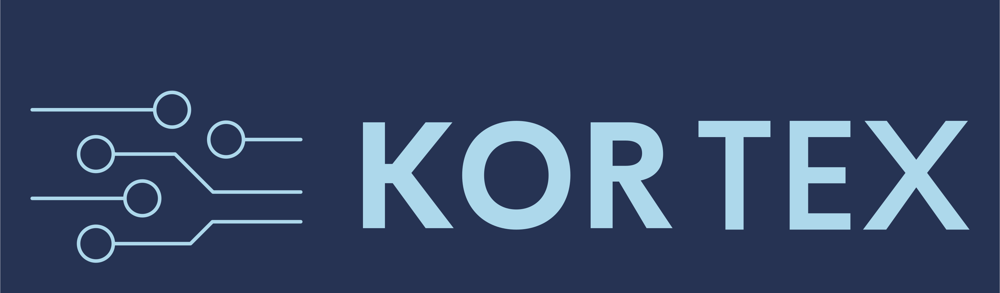
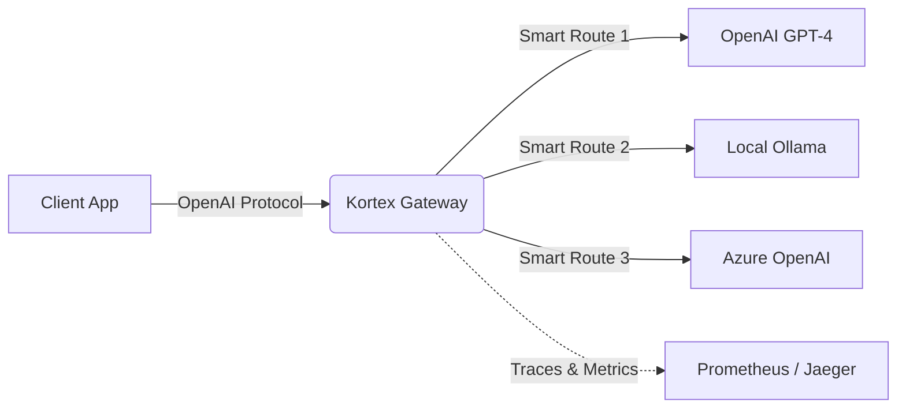

<p align="center">
  
</p>

<p align="center">
  <strong>The Unified, Cloud-Native Gateway for Intelligent Inference</strong>
</p>

<p align="center">
  <a href="#-quick-start"></a>
  <a href="LICENSE"></a>
  <a href="https://kubernetes.io"></a>
  <a href="https://golang.org"></a>
  <a href="https://www.cncf.io"></a>
</p>

---

## Overview

**Kortex** is a high-performance, vendor-agnostic API Gateway designed specifically for Large Language Models (LLMs).

As AI engineering moves from "prototyping" to "production," managing direct dependencies on providers (OpenAI, Anthropic, Bedrock) becomes a liability. Kortex sits between your applications and your model providers, providing a **unified control plane** for routing, observability, and cost management.

**Write code once using the OpenAI standard format, and route to *any* model—local or cloud.**

---

## Why Kortex?

| Feature | Without Kortex | With Kortex |
| --- | --- | --- |
| **Provider Lock-in** | Hardcoded SDKs (`openai-python`, `anthropic-sdk`) | **Universal API:** Switch providers via config, zero code changes. |
| **Cost Control** | "Surprise" bills at the end of the month | **Smart Routing:** Route simple queries to cheaper models dynamically. |
| **Observability** | Black-box API calls | **Native OpenTelemetry:** Full traces for latency, token usage, and errors. |
| **Resilience** | Manual retry logic in every app | **Circuit Breakers:** Automatic failover (e.g., Azure OpenAI down → Fallback to AWS Bedrock). |

---

## Architecture

Kortex operates as a Kubernetes-native gateway (or lightweight binary) that intercepts inference requests.



### Kubernetes-Native Design

```
+-----------------------------------------------------------------+
|                         Kortex Gateway                          |
+-----------------------------------------------------------------+
|  +-------------+  +-------------+  +-------------+              |
|  |   Router    |  |  A/B Test   |  |   Cost      |              |
|  |   Engine    |  |   Manager   |  |   Tracker   |              |
|  +------+------+  +------+------+  +------+------+              |
|         |                |                |                     |
|  +------+----------------+----------------+------+              |
|  |              Fallback Handler                 |              |
|  +----------------------+------------------------+              |
+--------------------------+--------------------------------------+
                           |
           +---------------+---------------+
           v               v               v
     +----------+    +----------+    +----------+
     |  OpenAI  |    | Anthropic|    |  KServe  |
     |   API    |    |   API    |    |  vLLM    |
     +----------+    +----------+    +----------+
```

---

## Key Features

- **Lightweight Core:** Written in **Go**, designed for low-latency (<5ms overhead).
- **Smart Routing Engine:** Define rules based on prompt length, user tier, or cost budget.
  - *Example:* "If prompt > 4k tokens, route to `claude-3-opus`. Else, route to `llama-3-70b`."
- **Universal Protocol:** Speaks the standard OpenAI API format. Your existing tools (LangChain, LlamaIndex) work out of the box.
- **FinOps Aware:** Token counting middleware that tracks spend *before* the invoice arrives.
- **A/B Testing:** Consistent hash-based experiment assignment for model comparison.
- **Automatic Failover:** Chain fallback backends for high availability.

---

## Quick Start

### Kubernetes Installation

```bash
# Install CRDs
kubectl apply -f https://raw.githubusercontent.com/judeoyovbaire/kortex/main/config/crd/bases/gateway.kortex.io_inferencebackends.yaml
kubectl apply -f https://raw.githubusercontent.com/judeoyovbaire/kortex/main/config/crd/bases/gateway.kortex.io_inferenceroutes.yaml

# Deploy the controller
kubectl apply -f https://raw.githubusercontent.com/judeoyovbaire/kortex/main/config/manager/manager.yaml
```

### Basic Configuration

```yaml
# Create a backend for OpenAI
apiVersion: gateway.kortex.io/v1alpha1
kind: InferenceBackend
metadata:
  name: openai-gpt4
spec:
  type: External
  external:
    url: https://api.openai.com/v1
    provider: OpenAI
    apiKeySecret:
      name: openai-credentials
      key: api-key
  cost:
    inputTokenCost: "0.03"
    outputTokenCost: "0.06"
    currency: USD
---
# Create a route with fallback
apiVersion: gateway.kortex.io/v1alpha1
kind: InferenceRoute
metadata:
  name: production-route
spec:
  defaultBackend:
    name: openai-gpt4
  fallback:
    backends:
      - anthropic-claude
      - local-mistral
  costTracking: true
```

### Docker (Standalone Mode)

```bash
docker run -p 8080:8080 judeoyovbaire/kortex:latest
```

### Query (Using standard OpenAI format)

```bash
curl http://localhost:8080/v1/chat/completions \
  -H "Authorization: Bearer sk-kortex-key" \
  -d '{
    "model": "gpt-4",
    "messages": [{"role": "user", "content": "Hello via Kortex!"}]
  }'
```

---

## Roadmap to CNCF Sandbox

### Phase 1: Foundation (Complete)
- [x] Multi-backend routing (KServe, External APIs, Kubernetes Services)
- [x] Weighted traffic distribution
- [x] Automatic failover chains
- [x] Prometheus metrics integration

### Phase 2: Intelligence (Complete)
- [x] A/B testing with consistent hashing
- [x] Per-user rate limiting
- [x] Real-time cost tracking
- [x] Health check monitoring

### Phase 3: Cloud Native (Complete)
- [x] **v0.2:** OpenTelemetry (OTLP) Tracing Support
- [x] **v0.2:** Smart routing (cost-based, latency-based, context-length)
- [x] **v0.3:** Circuit Breakers & Retries (exponential backoff, jitter, half-open state)
- [x] Configuration hot-reload (fsnotify-based file watching)

### Phase 4: Enterprise (Planned)
- [ ] **v1.0:** Multi-tenancy support
- [ ] Semantic caching
- [ ] Enterprise SSO
- [ ] Multi-cluster federation

---

## Contributing

We welcome contributions! Please see [CONTRIBUTING.md](CONTRIBUTING.md) for details on how to set up your development environment.

**Governance:** Kortex follows a BDFL governance model. See [GOVERNANCE.md](GOVERNANCE.md) for details.

**Code of Conduct:** This project adheres to the [CNCF Code of Conduct](CODE_OF_CONDUCT.md).

---

## Community

- **Website**: [judaire.io](https://judaire.io)
- **GitHub Issues**: [Report bugs or request features](https://github.com/judeoyovbaire/kortex/issues)
- **Security**: See [SECURITY.md](SECURITY.md) for reporting vulnerabilities

---

## License

Apache 2.0 - See [LICENSE](LICENSE) for details.

---

<p align="center">
  <sub>Built with purpose for the Cloud Native community</sub>
</p>